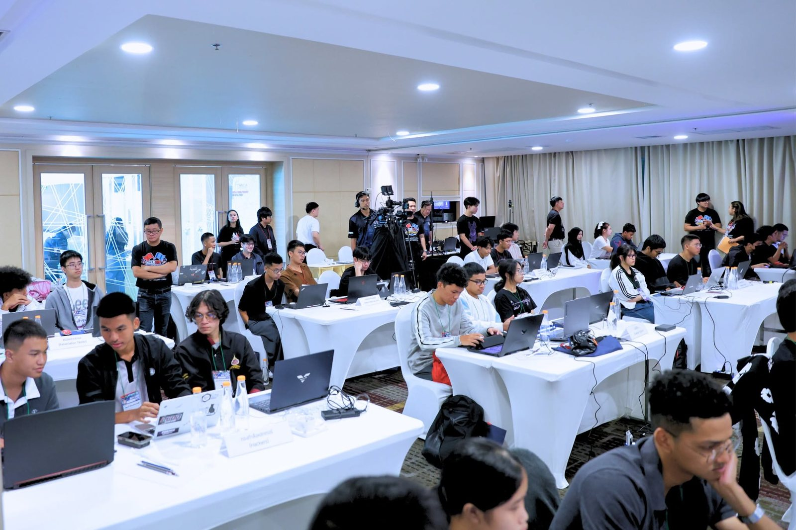
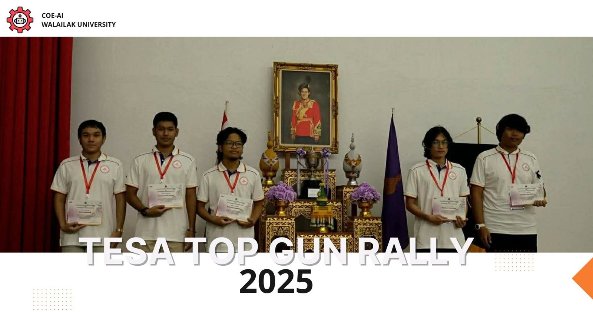
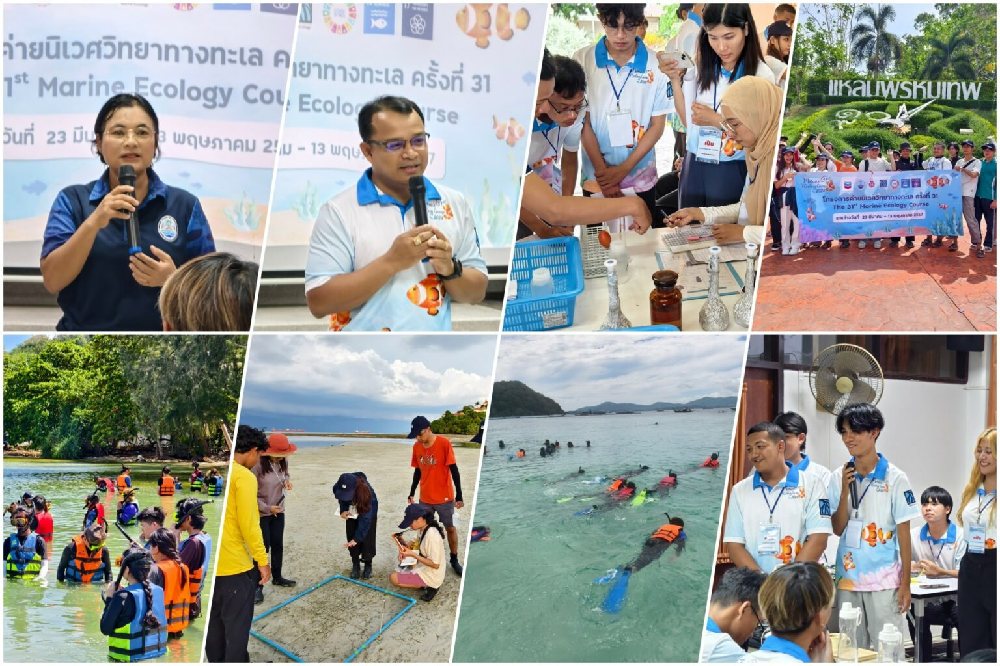

# 👋 Hi — I'm Wa (Ahmad-aduwa Da-oh)

I'm a multi-disciplinary developer from **Walailak University** working at the intersection of **Cybersecurity**, **AI/Data Science**, **IoT**, and **Web**.  
I like turning real-world problems into working, maintainable systems — and then learning how to break and harden them.

- 🏢 Currently an **Intern (Cooperative Education)** at [Armstrong Techs](https://www.armstrongtechs.com/)
- 📄 Co-author of an **IEEE** paper on a LoRaWAN-based landslide early warning system
- 🚩 **Winner — Mini CTF**, NCSA CTF Boot Camp 2025
- ✍️ I write penetration testing lab write-ups on [Medium](https://medium.com/@adu27747g)

---

## 🎯 Current Focus
- **Offensive security:** penetration testing, CTFs, and lab write-ups (network services, Windows attack chains)
- AIoT solutions (edge inference, LoRaWAN/MQTT, data pipelines)
- Backend & full-stack web apps (Node.js, React, PostgreSQL)
- **Career goal:** **Penetration Testing / Red Teaming**

---

## 💼 Experience
| Period | Role | Organization |
| --- | --- | --- |
| Sep 2026 – Apr 2027 | Intern (Cooperative Education) | [Armstrong Techs](https://www.armstrongtechs.com/) |
| Mar – Apr 2026 | Short-term Cross-cultural Exchange (Student Training Program) | Ningbo City College of Vocational Technology, China |
| Apr – Jun 2025 | Backend Developer Intern | Nightbears Technology Co., Ltd. |

---

## 📄 Publication
**[A LoRaWAN-based Landslide Early Warning System using Unsupervised AI](https://ieeexplore.ieee.org/document/11512451)**  
U. Chakma, N. Afsarimanseh, C. Alee, A. Chantaveerod, **A. Da-Oh**, M. E. E. Alahi  
*2025 18th International Conference on Sensing Technology (ICST)*, IEEE — DOI: [10.1109/ICST66402.2025.11512451](https://doi.org/10.1109/ICST66402.2025.11512451)

A low-cost, low-power IoT system for real-time landslide monitoring: sensor nodes (rainfall, soil moisture, geophone, temperature, humidity) send data over LoRaWAN, and an Isolation Forest model flags anomalies that indicate potential landslide events.

- 📰 Featured by Walailak University: [Low-cost real-time landslide warning system with AIoT](https://www.wu.ac.th/th/news/26262/)
- 💻 Code: [Landslide](https://github.com/Ahmadaduwa/Landslide)

---

## 🏆 Competitions & Activities
| Year | Event | Result |
| --- | --- | --- |
| 2026 | **NCSA x CISCO CTF 2026** — NCSA CTF Thailand Tournament (team *MaiMeName67*) | Participant |
| 2025 | **TESA Top Gun Rally 2025** — "Defense Innovations", Chulachomklao Royal Military Academy | Participant |
| 2025 | **Mini CTF** — NCSA CTF Boot Camp, Hat Yai (team *กองกำลังแฮกเกอร์*) | 🥇 Winner |
| 2024 | **TESA Top Gun Rally 2024** — Kasetsart University Sriracha Campus | Participant |
| 2024 | **The 31st Marine Ecology Course** (hands-on), Phuket — [news](https://cas.wu.ac.th/archives/27200) | Completed |

  
  
  

CTF 2025 · TESA Top Gun Rally 2025 · Marine Ecology Course 2024

---

## 📜 Certificates
- **Road To Cybersecurity 2025 GEN6** — SOSECURE (Dec 2025)
- **Basic Cybersecurity** — NCSA Thailand MOOC (May 2025)
- **Super AI Engineer Season 5 — Foundation AI (Theory)** — Artificial Intelligence Association of Thailand (Mar 2025)
- **Internship Certificate, Backend Developer** — Nightbears Technology Co., Ltd. (Jun 2025)

---

## 🛠️ Skills & Tools
- Languages: **Python**, **JavaScript / TypeScript**, **C / C++**, **Dart**, C#, PHP
- Security: penetration testing labs, CTFs, OverTheWire (Bandit)
- Web & Backend: Node.js (Express), React, FastAPI, ASP.NET Core MVC, Laravel, PostgreSQL, Prisma, Redis, Docker Compose
- Mobile: Flutter, React Native
- ML / Computer Vision: PyTorch, TensorFlow/Keras, scikit-learn, YOLO, transfer learning, anomaly detection, time-series models (LSTM, TCN)
- Embedded & IoT: Raspberry Pi, LoRaWAN, MQTT, ALSA/pthreads in C, MATLAB, motor control

---

## 📚 Selected Projects

### 🛰️ AIoT & Embedded
- [Landslide](https://github.com/Ahmadaduwa/Landslide) — landslide detection and risk assessment from environmental sensor data with anomaly detection models (Isolation Forest, LSTM autoencoders); basis of the IEEE paper above
- [tesa2025](https://github.com/Ahmadaduwa/tesa2025) — TESA Top Gun Rally 2025: real-time drone detection & tracking (YOLO + ByteTrack, EfficientNet-B0 GPS regression), backend API (WebSocket/UDP, PostgreSQL + Prisma), map dashboard, MATLAB simulation over MQTT
- [PROJECT_TESA_2024](https://github.com/Ahmadaduwa/PROJECT_TESA_2024) — TESA Top Gun Rally 2024: real-time audio capture (ALSA), FFT, KNN classification, SQLite and MQTT in multi-threaded C
- [roboticGripper_flutter_reactNative](https://github.com/Ahmadaduwa/roboticGripper_flutter_reactNative) — robotic gripper control system: Flutter / React Native apps with a FastAPI backend, live force monitoring, teaching mode and auto-run
- [ModelGripper](https://github.com/Ahmadaduwa/ModelGripper) — time-series models for the gripper (1D-CNN, LSTM, CNN-LSTM, TCN)
- [motor_open_close_loop](https://github.com/Ahmadaduwa/motor_open_close_loop) — open-loop vs closed-loop motor RPM control experiments
- [Plant_Watering_System](https://github.com/Ahmadaduwa/Plant_Watering_System) — automatic plant watering system

### 🧠 AI / Computer Vision
- [durianLeafDisease](https://github.com/Ahmadaduwa/durianLeafDisease) — durian leaf disease classification (5 classes) with transfer learning across DenseNet-201, EfficientNetV2, MobileNetV3, Res2Net50 and ResNet50, plus Grad-CAM and a web app
- [flutter_durian](https://github.com/Ahmadaduwa/flutter_durian) — *RooJai Durian*: Flutter app for durian farmers with leaf disease detection, phenology calendar and weather-based advice
- [Mongoesteen](https://github.com/Ahmadaduwa/Mongoesteen) — mangosteen volume prediction from multi-view images (object detection + Xception regression)
- [detectCenterOfTheEye](https://github.com/Ahmadaduwa/detectCenterOfTheEye) — eye/pupil center detection with HOG + RandomForest and CNNs, with real-time OpenCV + MediaPipe demos
- [CrossSection](https://github.com/Ahmadaduwa/CrossSection) — wood cross-section measurement from images using object detection and a reference marker

### 🌐 Web
- [Ai_Apti](https://github.com/Ahmadaduwa/Ai_Apti) — school management system MVP with an AI student aptitude/career insight module (Express + TypeScript, FastAPI, React, PostgreSQL, Redis, Docker Compose)
- [SchoolSystem](https://github.com/Ahmadaduwa/SchoolSystem) — school management platform in ASP.NET Core MVC with JWT role-based access, scheduling, attendance and curriculum management
- [WuFreshyAward](https://github.com/Ahmadaduwa/WuFreshyAward) — Laravel web app

### 🔐 Security
- [BanditOverTheWire](https://github.com/Ahmadaduwa/BanditOverTheWire) — walkthrough of OverTheWire Bandit (levels 0–33) with a report and screenshot per level

---

## ✍️ Writing
Lab write-ups on [Medium](https://medium.com/@adu27747g), including:
- Lab Write-up: Attacking Common Services (Hard) — an end-to-end Windows penetration testing attack chain
- Lab Write-up: Attacking Common Services (Medium)

---

## 📫 Connect
- Email: adu27747g@gmail.com
- Medium: [@adu27747g](https://medium.com/@adu27747g)
- GitHub: [Ahmadaduwa](https://github.com/Ahmadaduwa)

---

## 📊 GitHub Stats

